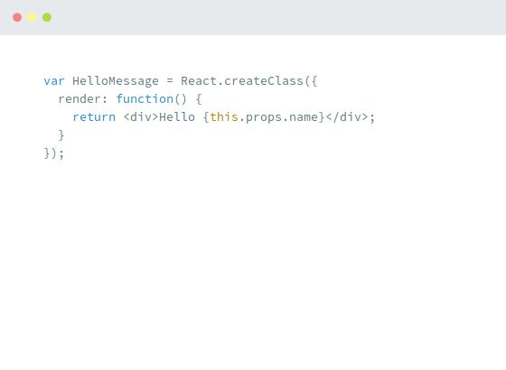
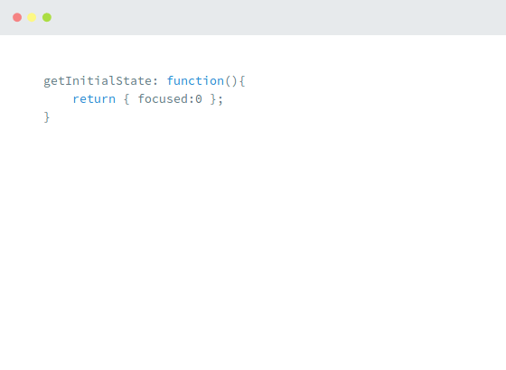
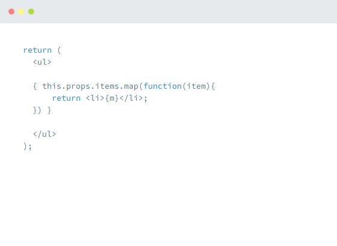

# Тестовое задание
## Описание
Приложение, позволяющее проводить quiz опросы.

Пользователю пошагово демонстрируются вопросы и варианты ответов.
На каждом шаге пользователь должен знать, правильно он ответил на вопрос или нет.
В конце опроса демонстрируется соотношение правильных ответов к общему количеству вопросов.

Вопрос может быть представлен в двух вариантах:
* Текстовый вопрос (прим. "What is React?");
* Вопрос с изображением (прим. "What does this code do?" и изображение с примером кода);

## Технические условия
* Можно использовать JavaScript / TypeScript;
* Использовать фреймворки вроде React, Angular, Vue не допускается;
* Не допускается использование Bootstrap и прочего схожего инструментария;
* Задание можно запустить на локальном dev сервере командой: `npm start`;
* Должно прилично выглядеть на экранах разных размеров;

## Пример списка вопросов для quiz (можно использовать свои):
1. What is React?
    * A JavaScript framework
    * CSS preprocessor
    * Language that compiles to CoffeeScript

2. Who made React?
    * Google
    * Twitter
    * Facebook

3. What is React used for?
    * Adding variables to CSS
    * Building web apps
    * Making websites cloud-ready

4. What is special about React?
    * It brings HTML6 features to today's browsers
    * Virtual DOM
    * Database integration

5. Which language is this?

    
    * JavaScript
    * CoffeeScript
    * JSX

6. What does this component do?

    
    * Prints "Hello World!"
    * Prints "Hello", followed by the name attribute that was passed when initializing the component
    * Prints the numbers from 1 to 10.

7. What does this code do?

    
    * Provides an initial value for the component's state
    * Tells how many times the component should be focused
    * Seeds a random number generator

8. What does this code do?

    
    * Initializes a new UL component, and generates LI components for each entry in the items array property.
    * Initializes a Google Map for every location in the items array
    * It won't work